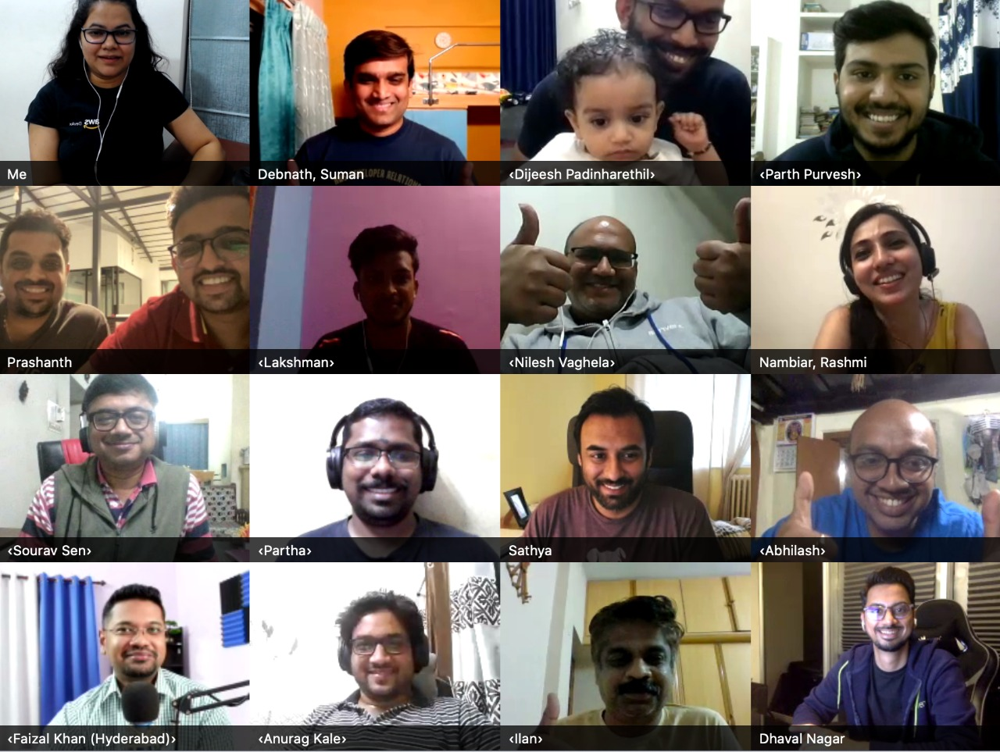

# Feburary 2021 AWS User Group Sync-up (SAARC) MoM

DATE: 09-Feb-2021 
TIME: 7PM-8PM (IST)

Thanks everyone for joining in :) 

 

## Few useful links 

- [AWS UG Branding Items](https://drive.google.com/file/d/1Ptk_zHFybol2DqEDur3-JAZ87NR4K9G0/view) : All icons, logos, badges, and backgrounds are available via a downloadable .zip folder

- [15 tips to scale a large workshop both online and in-person](https://www.slideshare.net/cfregly/15-tips-to-scale-a-large-aiml-workshop-both-online-and-inperson) : Few tips and best practices for scaling a large workshop for 1,000's of simultaneous attendees - both online and in-person. 

- [Virtual Events Guide](https://dangerouslyawesome.com/2020/04/virtual-events-guide) : Nice weekend read :) 

- [Guide for Hosting Virtual AWS User Group Events](https://docs.google.com/document/d/1gLDcQmBG3cpxm3QEZuDy0mzahuc9FqP2BV0hPQpR9c4/edit) : A document which outline virtual meeting resources, so you all AWS user group leaders can maintain engagement and host virtual events with their members. All of you are encouraged to contribute their learnings to this document. 

## Notes 
- Update your contact details, and T-shirt sizes in the sheet, which was shared in the our internal group 
- Adding your meetup group to our [AWS User Group Global Page](https://aws.amazon.com/developer/community/usergroups/) - Please reach out to Suman/Rohini if this is not done already. 
- Upload the city Icons Badge layouts to the folder “Custom-City-Icons-Badge” : Suman/Rohini to followup with the team 
- If you are hosting re:Cap in your city, please reachout to Suman/Rohini for credits 
- Check out our [AWS User Group Swag Store](https://stores.kotisdesign.com/awsusergroups/sign_in) to order t-shirts, stickers, pins and other various swag for your meetups.
- Join the [AWS User Group Leaders Slack channel](https://aws-usergroup-leaders.slack.com/) so you can interact and engage with us and other UG Leaders around the world
- Monthly sync up to be scheduled on the last Thursday of every month :) 

